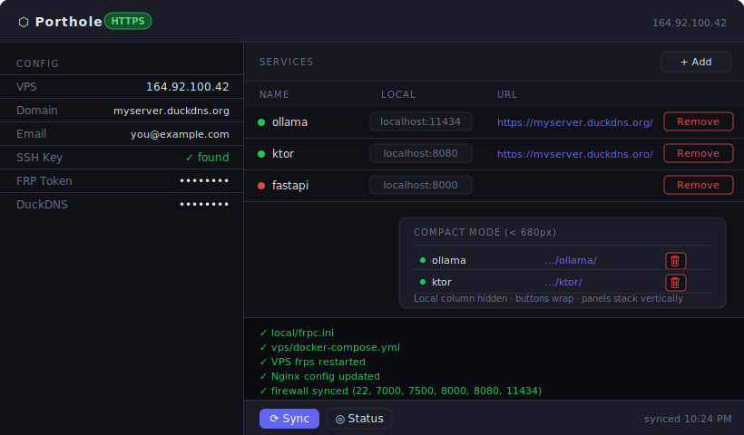

<div align="center">

# 🕳️ Porthole

**Expose your local AI models and servers to the internet — no router config needed.**

Tunnels any local service (Ollama, Ktor, FastAPI, …) through a cheap VPS using [FRP](https://github.com/fatedier/frp).

[](LICENSE)


</div>

---

## How it works

```
Your Machine                  VPS (DigitalOcean, etc.)          Internet
──────────────────────────    ──────────────────────────────    ──────────
ollama  :11434                frps listens on :7000
ktor    :8080    ──frpc──►    exposes all tunnels           ◄── any client
fastapi :8000                 on their configured ports
```

The tunnel is initiated **outbound** from your machine — no port forwarding or router changes needed.

---

## Web UI

```bash
python porthole.py ui
```

Opens a local dashboard at `http://localhost:7502` — no extra dependencies.



| Feature | Description |
|---|---|
| Config panel | Shows VPS host, domain, SSL mode, SSH key status |
| Services table | Live list of tunnels with their public URLs |
| Status dots | Green/red indicators updated on each status check |
| Sync button | Pushes configs to VPS and restarts frpc in one click |
| Add / Remove | Manage services without touching any config files |
| Output log | Inline terminal output from every action |

```bash
python porthole.py ui --port 8888   # custom port
```

---

## Requirements

| Where | What |
|---|---|
| Your machine | Python 3.8+, Docker |
| VPS | Docker, Ubuntu (any cloud provider) |

---

## Quick start

### 1 — Clone

```bash
git clone https://github.com/ronjunevaldoz/porthole.git
cd porthole
```

### 2 — Configure

```bash
python porthole.py config --vps <YOUR_VPS_IP>
python porthole.py config --token <FRP_TOKEN>    # or: --rotate-token to auto-generate
python porthole.py config --dashboard <PASSWORD>
```

### 3 — Add services

```bash
python porthole.py add ollama  11434 11434   # native Ollama
python porthole.py add ktor    8080  8080    # native Ktor
python porthole.py add fastapi 8000  8000    # native FastAPI
```

Each `add` automatically syncs configs, restarts frpc, updates the VPS, and opens the firewall port.

### 4 — Check status

```bash
python porthole.py status
#  ✓  frps control   :7000
#  ✓  ollama         http://<VPS_IP>:11434
#  ✓  ktor           http://<VPS_IP>:8080
```

---

## CLI reference

```bash
# ── Config ────────────────────────────────────────────────────────────────────
python porthole.py config                        # show all current settings
python porthole.py config --vps <IP>             # set VPS host
python porthole.py config --token <TOKEN>        # set FRP shared token
python porthole.py config --rotate-token         # auto-generate a new token
python porthole.py config --dashboard <PWD>      # set FRP dashboard password
python porthole.py config --domain <DOMAIN>      # set domain for HTTPS
python porthole.py config --duckdns-token <TOK>  # set DuckDNS token (auto DNS update)
python porthole.py config --email <EMAIL>        # set email for Let's Encrypt
python porthole.py config --ssh-key <PATH>       # set SSH key path (default: ~/.ssh/porthole_do)

# ── Services ──────────────────────────────────────────────────────────────────
python porthole.py list                          # list configured services
python porthole.py add <name> <lport> <rport>   # add a service and sync everything
python porthole.py add mydb 5432 5432 --docker postgres  # docker-based service
python porthole.py remove <name>                 # remove a service and sync

# ── Sync & status ─────────────────────────────────────────────────────────────
python porthole.py sync                          # force sync everything to VPS
python porthole.py status                        # check tunnel + HTTPS health

# ── HTTPS ─────────────────────────────────────────────────────────────────────
python porthole.py secure setup                  # install Nginx + SSL cert on VPS
python porthole.py secure status                 # check HTTPS endpoints + cert expiry
python porthole.py secure renew                  # force SSL cert renewal
```

---

## Enabling HTTPS

Porthole supports two modes:

| Mode | URL format | Setup |
|---|---|---|
| **Non-secure** (default) | `http://<VPS_IP>:11434` | No extra steps |
| **Secure** | `https://yourdomain.duckdns.org/ollama/` | Follow steps below |

### HTTPS setup

**1 — Get a free domain at [duckdns.org](https://www.duckdns.org)**
- Sign in with Google / GitHub
- Create a subdomain (e.g. `myporthole`)
- Copy your **token** shown at the top of the page

**2 — Configure**
```bash
python porthole.py config --domain myporthole.duckdns.org
python porthole.py config --duckdns-token <duckdns-token>
python porthole.py config --email you@gmail.com
```

**3 — Run secure setup**
```bash
python porthole.py secure setup
```

This automatically:
- Points your domain to the VPS via DuckDNS API
- Opens ports 80 + 443 on the firewall
- Installs Nginx + Certbot on the VPS
- Issues a free Let's Encrypt SSL certificate
- Configures auto-renewal (daily cron)

**4 — Access your services**
```
https://myporthole.duckdns.org/ollama/
https://myporthole.duckdns.org/ktor/
https://myporthole.duckdns.org/fastapi/
```

---

## Service types

| Service runs as | `--docker` flag | Example |
|---|---|---|
| Native process on your machine | *(omit)* | `python porthole.py add ktor 8080 8080` |
| Docker container (same compose) | `--docker <name>` | `python porthole.py add ollama 11434 11434 --docker ollama` |

> Native services must bind to `0.0.0.0`, not `127.0.0.1`.

---

## Server examples

### Ollama (native)
```bash
# macOS/Linux
OLLAMA_HOST=0.0.0.0 ollama serve

# Windows — set as system environment variable
# OLLAMA_HOST = 0.0.0.0
# then restart Ollama from the tray icon

python porthole.py add ollama 11434 11434
```

### Ktor
Bind to `0.0.0.0` in `application.conf`:
```hocon
ktor {
    deployment {
        port = 8080
        host = 0.0.0.0
    }
}
```
```bash
python porthole.py add ktor 8080 8080
```

#### WebSocket clients — enable ping/pong keepalives

Home servers sit behind residential ISPs that kill idle TCP connections after 30–60 seconds.
The nginx proxy on the VPS already sets a 24-hour read timeout, but the ISP NAT layer will
drop the connection long before that if no data flows. Fix it on the **client** with a ping interval:

```kotlin
// Ktor WebSocket client
val client = HttpClient(CIO) {
    install(WebSockets) {
        pingInterval = 20_000  // ms — send a ping every 20 s to keep the connection alive
    }
}
```

```kotlin
// kRPC / custom WebSocket session (server-side, Ktor routing)
webSocket("/api/rpc") {
    // The client ping above keeps the tunnel alive.
    // Optionally mirror it server-side for bidirectional keepalive:
    for (frame in incoming) {
        if (frame is Frame.Ping) send(Frame.Pong(frame.data))
        // ... handle your frames
    }
}
```

> **Rule of thumb:** set `pingInterval` to half the shortest expected NAT timeout — 20 s is safe
> for most residential ISPs and mobile networks.

### FastAPI
```bash
uvicorn main:app --host 0.0.0.0 --port 8000
python porthole.py add fastapi 8000 8000
```

---

## VPS setup (DigitalOcean)

```bash
# 1. Install and authenticate doctl
doctl auth init

# 2. Generate SSH key
ssh-keygen -t ed25519 -C "porthole" -f ~/.ssh/porthole_do -N ""
doctl compute ssh-key import porthole-key --public-key-file ~/.ssh/porthole_do.pub

# 3. Create $4/mo droplet (Singapore)
doctl compute droplet create porthole-vps \
  --region sgp1 --image ubuntu-24-04-x64 --size s-1vcpu-512mb-10gb \
  --ssh-keys <key-id> --tag-names porthole --wait \
  --user-data '#!/bin/bash
curl -fsSL https://get.docker.com | sh'

# 4. Create firewall (porthole CLI manages ports automatically after this)
doctl compute firewall create \
  --name porthole-fw --tag-names porthole \
  --inbound-rules "protocol:tcp,ports:22,address:0.0.0.0/0 protocol:tcp,ports:7000,address:0.0.0.0/0 protocol:tcp,ports:7500,address:0.0.0.0/0" \
  --outbound-rules "protocol:tcp,ports:all,address:0.0.0.0/0 protocol:udp,ports:all,address:0.0.0.0/0"

# 5. Deploy frps
ssh root@<VPS_IP> "mkdir -p ~/porthole/vps"
scp -r vps/ root@<VPS_IP>:~/porthole/
ssh root@<VPS_IP> "cd ~/porthole/vps && docker compose up -d"
```

---

## Using from a second machine

```bash
git clone https://github.com/ronjunevaldoz/porthole.git
cd porthole

python porthole.py config --vps <VPS_IP>
python porthole.py config --token <same-frp-token>
python porthole.py config --ssh-key ~/.ssh/your_key   # if key path differs

# Generate frpc.ini and start the tunnel
python porthole.py sync
docker compose -f local/docker-compose.yml up -d
```

---

## Dashboard

`http://<VPS_IP>:7500` — login `admin` / your dashboard password to monitor live tunnels.

---

## Security notes

- Traffic is **not TLS-encrypted** by default. Use `python porthole.py secure setup` for HTTPS.
- Never commit `.env` files — `.gitignore` already excludes them.
- Rotate your FRP token anytime: `python porthole.py config --rotate-token && python porthole.py sync`
- SSL certificates auto-renew via a daily cron job on the VPS.

---

## License

MIT
